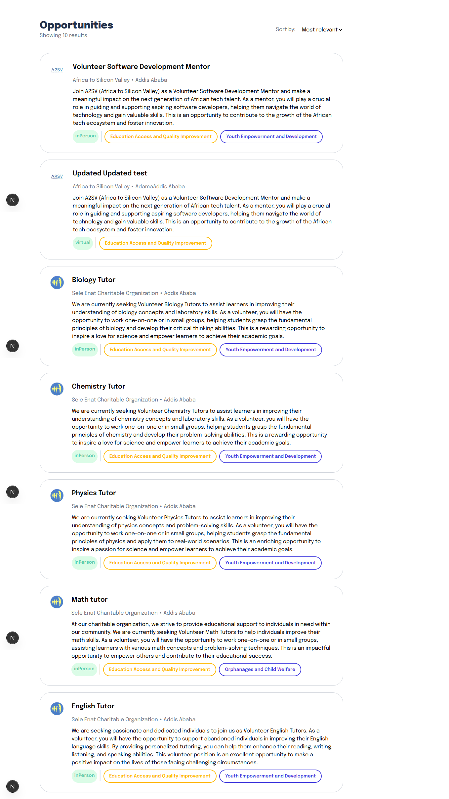
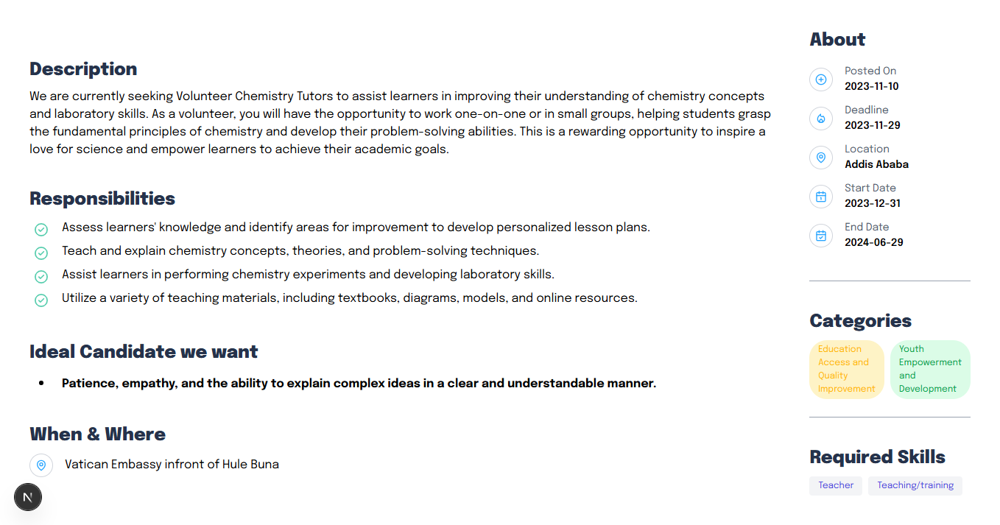
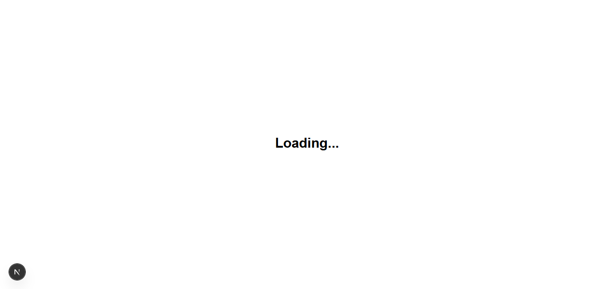
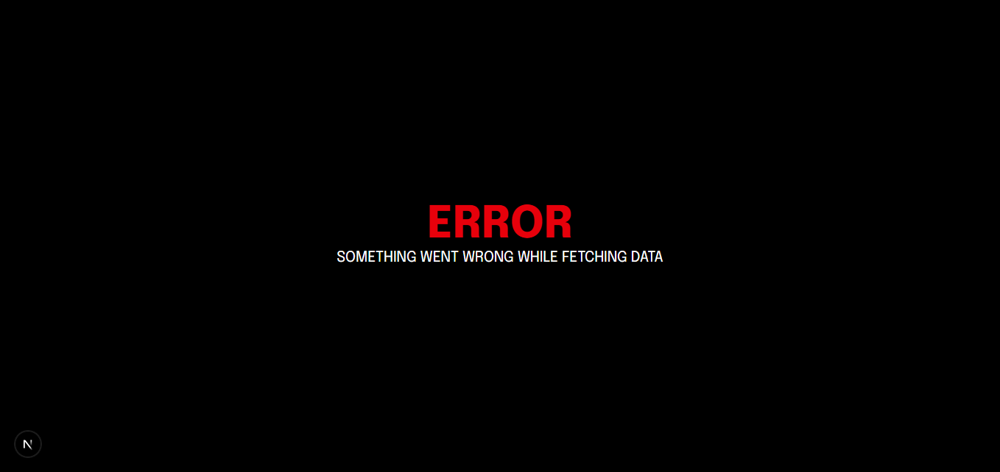

# A2SV Job Listing Platform

A modern web application for browsing, searching, and viewing job opportunities. Built for the A2SV project phase, this platform fetches job listings from a backend API and displays them with details.

## Features

- Browse a list of job opportunities
- View detailed job descriptions

## Tech Stack

- **Frontend:** Next.js (React, TypeScript)
- **State Management:** Redux Toolkit Query
- **Styling:** Tailwind CSS
- **API:** Fetches jobs from a REST backend (RTK Query, Axios)
- **Image Handling:** next/image with remote patterns (Cloudinary)

### Running the Development Server

```bash
npm run dev
```

Visit [http://localhost:3000](http://localhost:3000) in your browser.

## Screenshots





